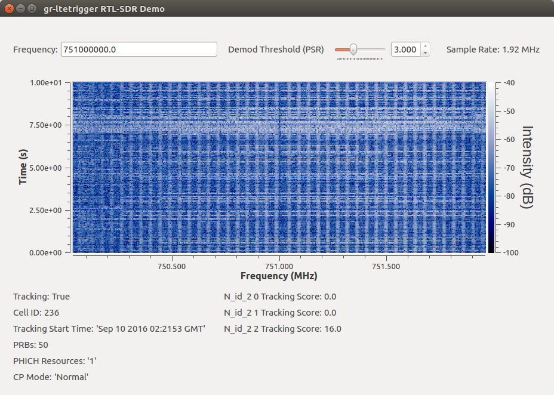
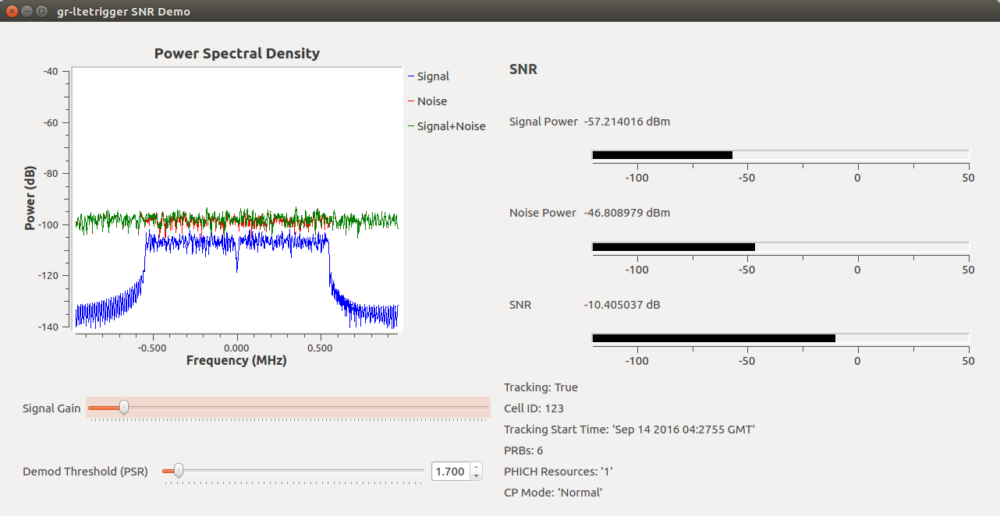

gr-ltetrigger
=============

gr-ltetrigger is a set of utilities for sensing LTE. It is built using GNU
Radio and srsLTE.

Screenshots
-----------

Building
--------

#. Install SWIG, GNU Radio, GNU Radio Companion, fftw and gr-osmosdr (example assumes Ubuntu 16.04, adjust as needed)

   .. code:: bash

             $ sudo apt install gnuradio-dev swig fftw-dev gr-osmosdr

#. Build and install srsLTE. There is a naming collision between srsLTE
   and a requirement of GNU Radio, which we must fix before building:

   .. code:: bash

             $ git clone https://github.com/srslte/srslte
             $ cd srslte
             $ grep -R -l " DEBUG(" . |xargs sed -i 's/ DEBUG(/ SRSLTE_DEBUG(/g'
             $ find -name ue_cell_search.c |xargs sed -i 's/DEBUG/SRSLTE_DEBUG/g'
             $ mkdir build; cd build
             $ cmake ../
             $ make && make test
             $ sudo make install

#. Build and install gr-ltetrigger:

   .. code:: bash

             $ git clone https://github.com/NTIA/gr-ltetrigger
             $ cd gr-ltetrigger
             $ mkdir build; cd build
             $ cmake ../
             $ make && make test
             $ sudo make install
             $ sudo ldconfig

Quick Start
-----------

.. code:: bash

          $ cd gr-ltetrigger/examples
          $ ./cell_search_file.py --help
          linux; GNU C++ version 5.3.1 20160413; Boost_105800; UHD_003.010.git-202-g9e0861e1

          usage: cell_search_file.py [-h] -s Hz [-f Hz] [--repeat] [-c N]
          [--throttle Hz] [--time-out sec]
          [--threshold THRESHOLD]
          filename

          positional arguments:
          filename

          optional arguments:
          -h, --help            show this help message and exit
          -s Hz, --sample-rate Hz
          input data's sample rate [Required]
          -f Hz, --frequency Hz
          input data's center frequency
          --repeat              loop file until cell found or cut-off reached
          [default=False]
          -c N, --cut-off N     stop looping after N samples [default=-1]
          --throttle Hz         throttle file source to lower CPU load [default=None]
          --time-out sec        max time in seconds to perform search [default=-1]
          --threshold THRESHOLD
          set peak to side-lobe ratio threshold [default=4]
          $ ./cell_search_file.py --sample-rate 15.36M ../test_frames/lte_frame_50prb_cellid_125 --repeat --time-out 1
          linux; GNU C++ version 5.3.1 20160413; Boost_105800; UHD_003.010.git-202-g9e0861e1

          Using Volk machine: avx2_64_mmx
          Starting cell search... done.
          {'cell_id': 125L,
          'cp_len': 'Normal  ',
          'nof_phich_resources': '1',
          'nof_prb': 50L,
          'nof_tx_ports': 1L,
          'phich_len': 'Normal',
          'sfn_offset': 0L,
          'tracking_start_time': 1464123775L}

Support
-------
Douglas Anderson | NTIA/Institute for Telecommunication Sciences | danderson@ntia.doc.gov

Legal
-----
See `LICENSE`_.

.. _LICENSE: LICENSE.txt
